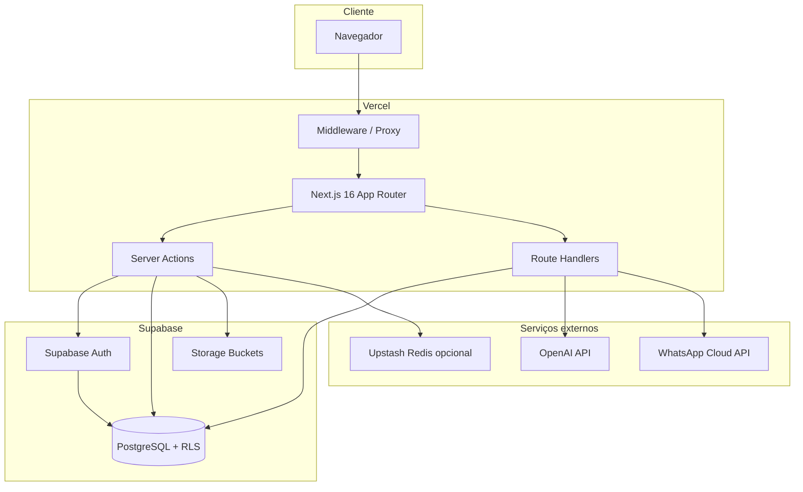

# 1. Arquitetura do projeto

## Visão geral

O Cedro Obras é uma aplicação **SaaS interna** para gestão de obras de construção civil. Combina um frontend Next.js com backend serverless (Server Actions + Route Handlers) e Supabase como BaaS (PostgreSQL, Auth, Storage).

## Camadas

| Camada | Responsabilidade | Tecnologia |
|--------|------------------|------------|
| **Apresentação** | Páginas, formulários, gráficos | React 19, Tailwind CSS 4, Recharts |
| **Roteamento** | Proteção por perfil, redirects | `middleware.ts` |
| **Aplicação** | Regras de negócio, orquestração | Server Actions em `app/actions/` |
| **Domínio** | Lógica pura (classificação, IA, formatos) | `lib/` |
| **Dados** | Queries, RLS, Storage | Supabase client/server/admin |
| **Integrações** | IA, WhatsApp | OpenAI, Meta Graph API |

## Clientes Supabase

| Cliente | Arquivo | Uso |
|---------|---------|-----|
| Browser | `lib/supabase.ts` | Apenas Auth no client (legado mínimo) |
| Server (sessão) | `lib/supabase-server.ts` | Server Components e actions com cookies |
| Middleware | `lib/supabase/middleware.ts` | Refresh de sessão em cada request |
| Admin (service role) | `lib/supabase-admin.ts` | Webhooks, CRUD Auth, auditoria server-side |

A **service role nunca** é exposta ao browser.

## Perfis de usuário

| Role | Home | Escopo |
|------|------|--------|
| `admin` | `/dashboard` | CRUD completo + auditoria + configuração |
| `funcionario` | `/portal/notas` | Envio e consulta das próprias notas |
| `diretoria` | `/dashboard` | Leitura dashboard/financeiro (sem CRUD admin) |

## Módulos funcionais

1. **Autenticação unificada** — login único em `/login`
2. **Dashboard** — visão consolidada de obras e gastos
3. **Obras e clientes** — cadastro e acompanhamento
4. **Gastos** — lançamento manual e importação em lote
5. **Notas fiscais** — upload, IA, aprovação, lançamento de gastos
6. **Portal de Notas** — envio pelo funcionário de campo
7. **Engenheiro Cedro** — assistente IA com dados das obras
8. **Auditoria** — trilha de ações sensíveis
9. **WhatsApp** — recebimento de notas via Meta Cloud API (opcional)

## Segurança em profundidade

1. **Middleware** — bloqueia rotas HTML por role
2. **Server Actions** — `requireAdminSession()` / `requirePortalSession()`
3. **RLS PostgreSQL** — barreira primária contra REST API com anon key
4. **Storage policies** — arquivos de notas por ownership
5. **Rate limiting** — login e envio portal (memória ou Upstash)
6. **Headers HTTP** — HSTS, X-Frame-Options, etc. (`next.config.ts`)

## Deploy

- **App:** Vercel (Node.js serverless)
- **Banco / Auth / Storage:** Supabase (região configurável)
- **Secrets:** Vercel Environment Variables + Supabase Dashboard
