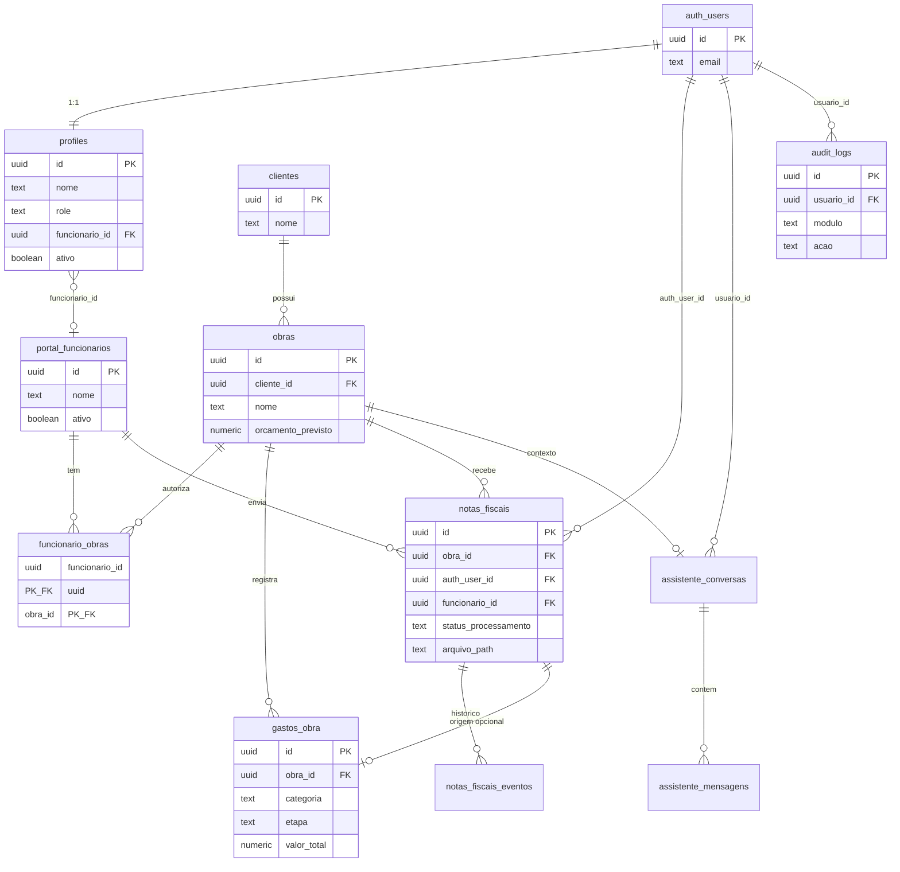

# 4. Relação entre tabelas

## Diagrama entidade-relacionamento



## Relacionamentos principais

| De | Para | Cardinalidade | Regra |
|----|------|---------------|-------|
| `profiles.id` | `auth.users.id` | 1:1 | Perfil criado no signup |
| `profiles.funcionario_id` | `portal_funcionarios.id` | N:1 | Funcionário vinculado ao cadastro portal |
| `funcionario_obras` | funcionário + obra | N:N | Autorização de envio por obra |
| `notas_fiscais.auth_user_id` | `auth.users.id` | N:1 | Ownership no portal |
| `notas_fiscais.obra_id` | `obras.id` | N:1 | Obra da nota |
| `gastos_obra.obra_id` | `obras.id` | N:1 | Gasto alocado |
| `obras.cliente_id` | `clientes.id` | N:1 | Cliente da obra |

## Integridade referencial

- **ON DELETE CASCADE** em notas → remove eventos e arquivos (via app).
- **Funcionário inativo** (`portal_funcionarios.ativo = false`) → não aparece em listagens admin ativas.
- **Perfil inativo** (`profiles.ativo = false`) → login bloqueado no middleware.

## Storage (não relacional)

```
storage.objects (bucket: notas-fiscais)
  └── {obra_id}/{uuid}/{filename}
       └── vinculado por notas_fiscais.arquivo_path
```

Policy: admin vê tudo; funcionário vê apenas arquivos das próprias notas.
