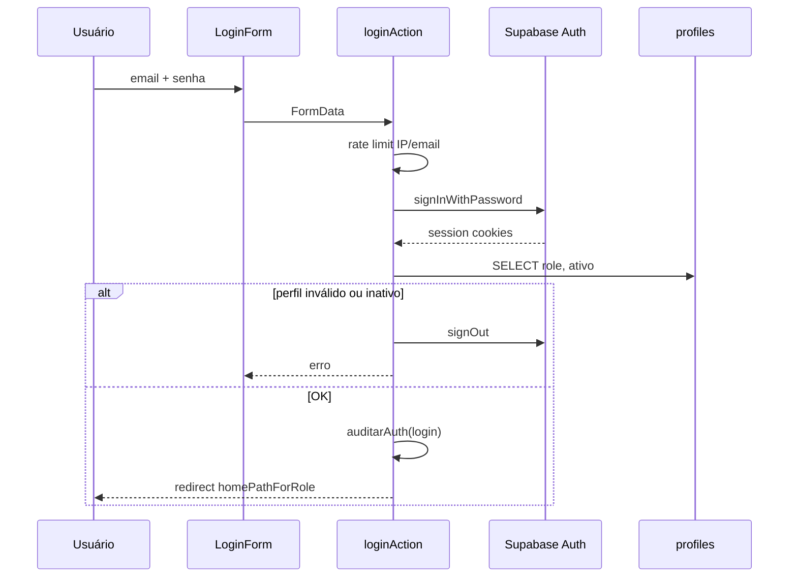

# 5. Fluxo de autenticação

## Login unificado

Todos os usuários entram em **`/login`** (rota pública).

## Destinos pós-login

| Role | Redirect |
|------|----------|
| `admin` | `/dashboard` |
| `funcionario` | `/portal/notas` |
| `diretoria` | `/dashboard` |

Parâmetro opcional `?next=/rota` redireciona após login (se path interno válido).

## Sessão

- Cookies **httpOnly** gerenciados por `@supabase/ssr`
- Refresh automático no **middleware** a cada request
- `getAppSession()` lê `auth.users` + `profiles` no servidor

## Logout

1. `logoutAction()` registra auditoria
2. `supabase.auth.signOut()`
3. Redirect para `/login`

## Callback OAuth

`/auth/callback` processa redirects do Supabase Auth (ex.: magic link futuro).

## Criação de usuários

| Método | Quem | Como |
|--------|------|------|
| Admin UI | Admin | `/admin/funcionarios` → criar com senha temporária |
| Script CLI | DevOps | `npm run admin:create-user` |
| Signup público | — | **Desabilitado** — trigger força `role = funcionario` se habilitado |

## Requisitos de perfil funcionário

Para enviar notas no portal:

1. `profiles.role = 'funcionario'`
2. `profiles.ativo = true`
3. `profiles.funcionario_id` vinculado a `portal_funcionarios`
4. Pelo menos uma linha em `funcionario_obras`

Sem `funcionario_id` → mensagem de perfil incompleto.

## Rate limiting (login)

- **8 tentativas** por IP e por email em **15 minutos**
- Implementado em `lib/login-rate-limit.ts`
- Opcional: Upstash Redis para múltiplas instâncias Vercel
