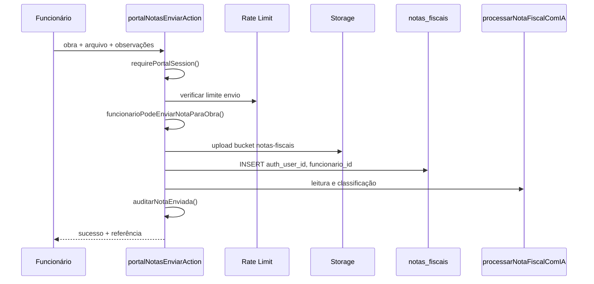

# 7. Fluxo do Portal de Notas

Destinado ao **funcionário de campo** enviar notas fiscais (foto ou PDF) vinculadas a uma obra autorizada.

## Rotas

| Rota | Função |
|------|--------|
| `/portal/notas` | Formulário de envio |
| `/portal/minhas-notas` | Lista das próprias notas |
| `/portal/minhas-notas/[id]` | Detalhe e preview |

## Fluxo de envio

## Validações

| Etapa | Regra |
|-------|-------|
| Sessão | Funcionário autenticado com `funcionario_id` |
| Obra | Deve existir em `funcionario_obras` |
| Arquivo | PDF, PNG, JPG; máx. 10 MB |
| MIME | Validado em `lib/portal-notas/validar-arquivo.ts` |
| Rate limit | Configurável em `lib/portal-notas/config.ts` |

## Status visíveis ao funcionário

| Status interno | Label no portal |
|----------------|-----------------|
| `aguardando` | Recebida |
| `processando` | Em análise |
| `pendente_aprovacao` | Aguardando aprovação |
| `aprovada` | Aprovada |
| `rejeitada` | Rejeitada |
| `correcao_solicitada` | Aguardando aprovação |
| `erro` | Erro no processamento |

## Minhas Notas — isolamento

- Lista filtrada: `auth_user_id = session.userId`
- Detalhe: retorna `null` (404) se ID pertence a outro usuário
- Arquivo: signed URL via server action com sessão

## Após envio

1. Nota fica com status `aguardando` ou `processando`
2. IA extrai fornecedor, itens, valores (assíncrono)
3. Admin vê pendência em `/financeiro/notas-fiscais`
4. Após aprovação → gastos lançados em `gastos_obra`

## O que o funcionário **não** pode fazer (v1.0)

- Editar perfil ou senha (admin altera em `/admin/funcionarios`)
- Ver notas de outros funcionários
- Escolher obras não autorizadas
- Aprovar ou rejeitar notas
