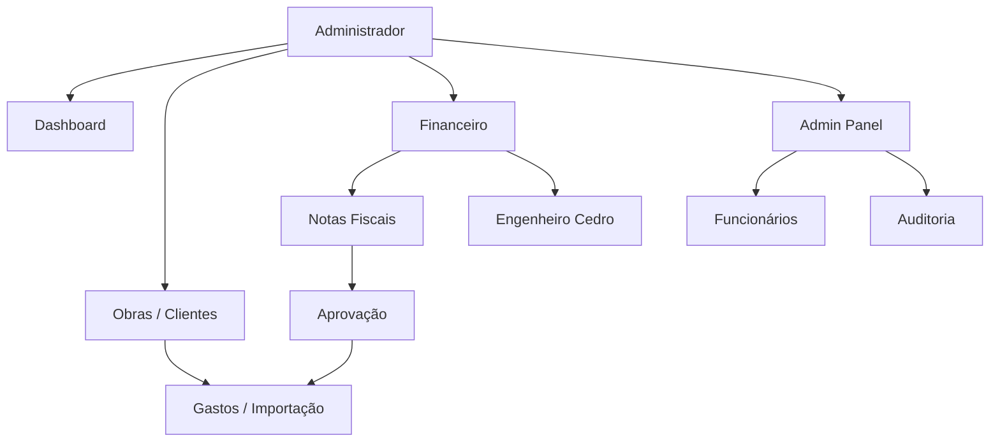

# 8. Fluxo administrativo

Área restrita a **`role = admin`**.

## Módulos

## Obras e clientes

| Ação | Rota | Server Action |
|------|------|---------------|
| Listar obras | `/obras` | Query server |
| Nova obra | `/obras/nova` | `criarObraAdminAction` |
| Detalhe + gastos | `/obras/[id]` | Query server |
| Importar gastos | `/obras/[id]/importar-gastos` | `importarGastosObraAdminAction` |
| Clientes | `/clientes` | `criarClienteAdminAction` |

Auditoria de obras/clientes/gastos: **triggers SQL** automáticos.

## Notas fiscais (admin)

| Etapa | Descrição |
|-------|-----------|
| Upload | Admin envia PDF/imagem em `/financeiro/notas-fiscais` |
| IA | `/api/notas-fiscais/ler` extrai dados |
| Revisão | Admin confere itens, categorias e etapas |
| Pendência | `enviarNotaParaAprovacaoAction` |
| Aprovação | `aprovarNotaFiscalAction` → INSERT em `gastos_obra` |
| Rejeição | `rejeitarNotaFiscalAction` |
| Correção | `solicitarCorrecaoNotaFiscalAction` → funcionário reenvia |

Permissão de aprovação derivada da **sessão admin** (não há seletor local de perfil).

## Gestão de funcionários

Rota: `/admin/funcionarios`

- Criar usuário Auth + perfil
- Definir role (`admin` ou `funcionario`)
- Vincular `portal_funcionarios` pelo nome
- Ativar / desativar conta
- Alterar senha temporária

Todas as mutações geram log via `auditarFuncionario()`.

## Engenheiro Cedro

Rota: `/financeiro/assistente`

- Perguntas em linguagem natural sobre obras, gastos, etapas
- Conversas privadas por `usuario_id`
- Dados agregados de snapshot interno + OpenAI opcional

## WhatsApp (opcional)

- Webhook: `POST /api/webhooks/whatsapp`
- Recebe imagem/PDF → cria nota com origem `whatsapp`
- Requer `WHATSAPP_APP_SECRET` para validação HMAC

## Painel Admin

| Rota | Função |
|------|--------|
| `/admin` | Hub com links |
| `/admin/funcionarios` | CRUD usuários |
| `/admin/auditoria` | Consulta `audit_logs` |

## Diretoria (role futuro)

- Acessa `/dashboard` e `/financeiro` (leitura)
- **Não** acessa `/admin`, `/obras`, `/clientes`
- RLS: SELECT em notas, obras, gastos, clientes
