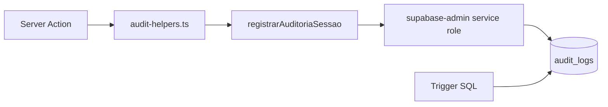

# 10. Auditoria

Rota: **`/admin/auditoria`** (somente admin).

## Tabela `audit_logs`

Registro centralizado de ações sensíveis. **Append-only** via RLS (sem UPDATE/DELETE para usuários).

## O que é auditado (v1.0)

| Módulo | Ações | Origem |
|--------|-------|--------|
| **auth** | login, logout | `auditarAuth()` |
| **funcionarios** | criação, alteração perfil, ativação | `auditarFuncionario()` |
| **notas_fiscais** | envio portal, envio aprovação, aprovação, rejeição, correção, alteração categoria/obra/valor | `audit-helpers.ts` |
| **obras** | INSERT, UPDATE, DELETE | Trigger SQL |
| **clientes** | INSERT, UPDATE, DELETE | Trigger SQL |
| **gastos_obra** | INSERT unitário | Trigger SQL |

## O que **não** é auditado (v1.0)

- Upload admin direto (sem action de auditoria dedicada)
- Importação bulk de gastos (apenas inserts individuais via trigger)
- Perguntas ao Engenheiro Cedro
- Recebimento WhatsApp
- Exclusão de conversas do assistente

## Implementação

**Fail-safe:** se insert falhar, a operação principal não é revertida (log best-effort).

## Campos registrados

- Quem: `usuario_id`, `usuario_nome`, `usuario_email`, `usuario_role`
- O quê: `modulo`, `acao`, `descricao`
- Onde: `tabela`, `registro_id`
- Quando: `created_at`
- Contexto: `ip`, `user_agent` (quando disponível)

## Consulta na UI

`AdminAuditoriaClient` — filtros por módulo, período e busca textual.

Server action: `listarAuditoriaAdminAction()` com paginação.

## Retenção

- Sem purge automático na v1.0
- Recomendado: política de retenção de 12–24 meses em produção
- Supabase plano pago inclui backup PITR (ver manual de backup)

## Conformidade

Logs permitem responder:

- Quem aprovou a nota X?
- Quando o funcionário Y foi desativado?
- Quais alterações foram feitas na obra Z?
